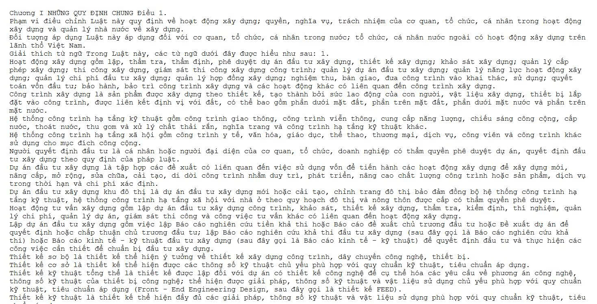
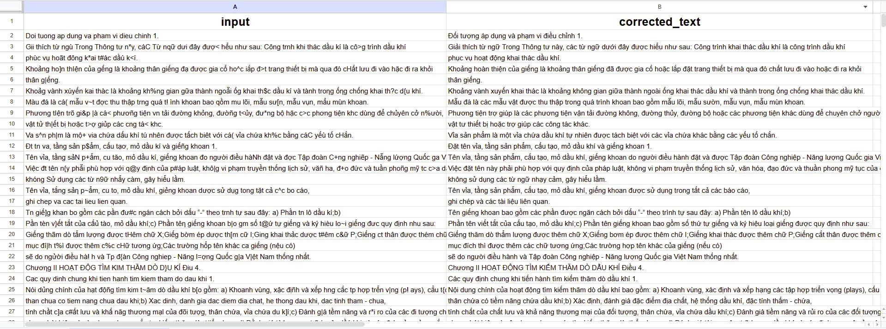
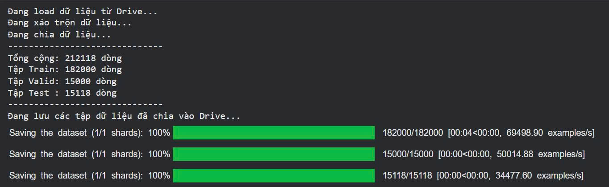
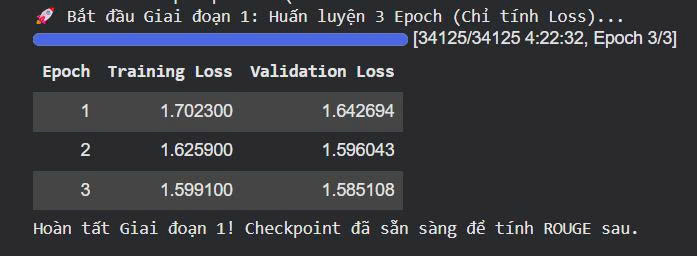
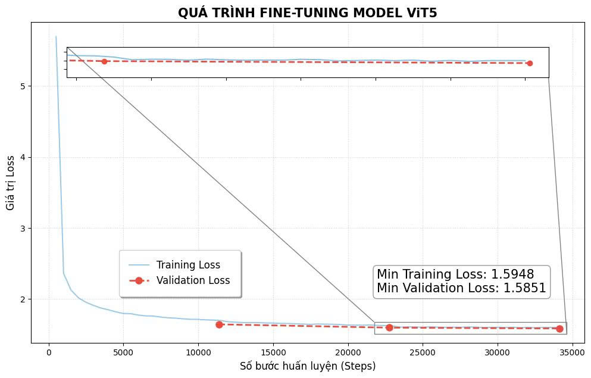
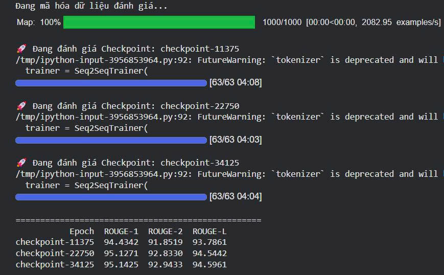
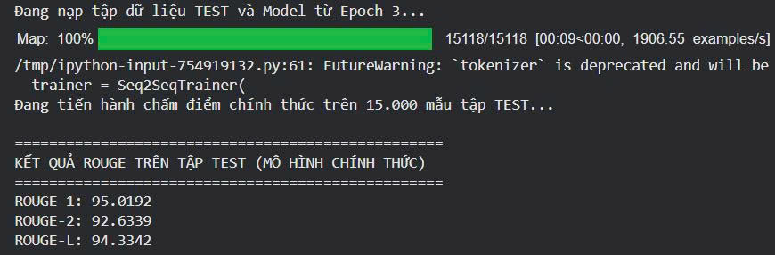

# Vietnamese Legal Document OCR Correction with ViT5

This project focuses on fine-tuning the **ViT5** model to post-process and correct Vietnamese text errors generated by **PaddleOCR**, specifically within the domain of Vietnamese legal and administrative documents.

---

## Video Demo

  
  
<i>Click the image above to watch the demonstration on YouTube</i>

The project features a frontend built with **Streamlit**, providing an intuitive interface for real-time OCR error correction.

---

## Project Pipeline

The workflow is divided into three main stages:

### Stage 1: Data Acquisition & Corpus Building
We collected high-quality legal text from the two largest official databases in Vietnam:
* [vbpl.vn](https://vbpl.vn)
* [thuvienphapluat.vn](https://thuvienphapluat.vn)

**Process:** Data crawling -> Cleaning -> Normalization -> Merging into a complete sentence-based corpus.

**Resulting Clean Dataset:**

---

### Stage 2: Synthetic Dataset Generation
To train the model, we simulated common PaddleOCR errors encountered when processing Vietnamese characters (e.g., misreading tone marks or similar-looking characters).

* **Input**: Clean sentences from Stage 1.
* **Output**: Pairs of "Noisy Text" (simulated OCR error) and "Ground Truth" (clean text).

**Simulated Error Dataset:**

---

### Stage 3: Model Fine-tuning
The **ViT5** model (a T5 architecture pretrained for Vietnamese) was fine-tuned on the synthetic dataset to learn the mapping from corrupted OCR output back to standard legal text.

**Data Split:**
The dataset was partitioned into Training, Validation, and Test sets:

**Fine-tuning Process:**
The training logs during the fine-tuning stage:

---

## Evaluation & Results

### Training Visualization
We monitored the training progress over 3 epochs using Matplotlib to ensure convergence and track loss/metrics.

### Model Selection
After 3 epochs, we evaluated each checkpoint on the validation set to select the best-performing model.

### Final Performance on Test Set
The best-performing model (Epoch 3) was evaluated on the independent test set to verify its generalization capabilities on unseen legal documents.

---

## Technologies Used
* **Model**: ViT5 (Viet2Viet)
* **Framework**: Transformers (HuggingFace), PyTorch
* **OCR Engine**: PaddleOCR (for error simulation research)
* **Frontend**: Streamlit
* **Visualization**: Matplotlib
* **Data Source**: vbpl.vn, thuvienphapluat.vn

---
*Developed as part of a research project on improving OCR quality for Vietnamese Administrative Documents.*
